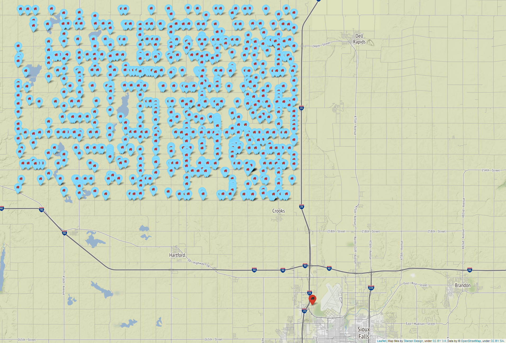

# VRPD-DSS
 Vehicle routing problem with drones and drone speed selection

The basis of all test instances is an approximately 20 km by 30 km rectangle located in Minnehaha County, South Dakota, USA. We have selected ca. 700 possible customer locations and an UPS Customer Center in Sioux Falls as the depot. The map below shows the distribution of the selected customer locations (blue) and the depot (red). To create a single instance, we randomly select the requested number of customers from all customer locations.

